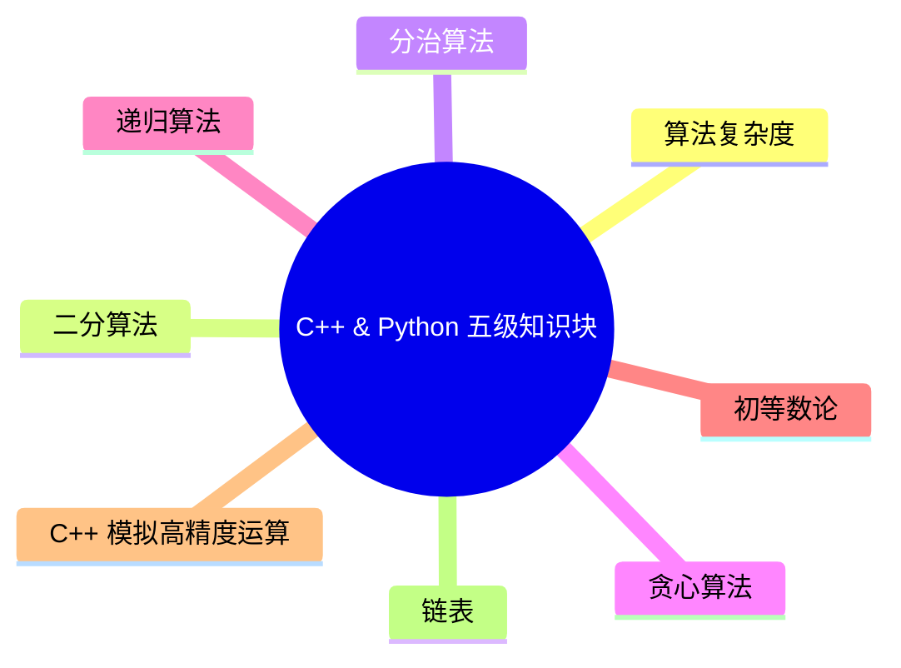

# C++ & Python 编程五级标准

## （一）知识点详述

1. 掌握初等数论相关知识的概念和应用，包括素数与合数、最大公约数与最小公倍数、同余与模运算、约数与倍数、质因数分解、奇偶性等。
2. 掌握 C++ 数组模拟高精度加法、减法、乘法和除法的相关知识。
3. 掌握链表的创建、插入、删除、遍历和反转操作，理解单链表、双链表、循环链表的区别。
4. 掌握辗转相除法（也称欧几里得算法）、素数表的埃氏筛法和线性筛法、唯一分解定理的原理和应用。
5. 掌握算法复杂度估算方法（含多项式、对数）。
6. 掌握二分查找和二分答案算法（也称二分枚举法）的基本原理，能够在有序数组中快速定位目标值。
7. 掌握递归算法的基本原理，能够应用递归解决问题，能够分析递归算法的时间复杂度和空间复杂度，了解递归的优化策略。
8. 掌握贪心算法的基本原理，理解最优子结构，能够使用贪心算法解决相关问题。
9. 掌握分治算法的基本原理，能够使用归并排序和快速排序对数组进行排序。

## （二）考核目标

掌握初等数论知识点，能够使用辗转相除法（也称欧几里得算法）、素数表的埃氏筛法和线性筛法、唯一分解定理等相关知识解决相应的问题。掌握单链表、双链表、循环链表的基本操作方法。掌握算法复杂度估算方法（含多项式、对数），熟悉二分法、分治法、贪心算法和递归算法的算法思想，能够根据实际情况选择合适的算法并完成解决相应的问题。C++ 掌握使用数组模拟高精度加法、减法、乘法和除法的知识。

## （三）知识块

## （四）知识点描述

| 编号 | 知识块 | 知识点 |
|---:|---|---|
| 1 | 初等数论 | 素数与合数、最大公约数与最小公倍数、同余与模运算、约数与倍数、质因数分解、奇偶性 欧几里得算法 唯一分解定理 素数表的埃氏筛法和线性筛法 |
| 2 | 算法复杂度估算方法 | 含多项式的算法复杂度 含对数的算法复杂度 |
| 3 | C++ 高精度运算 | C++ 数组模拟高精度加法、减法、乘法、除法 |
| 4 | 链表 | 单链表、双链表、循环链表的创建、插入、删除、遍历、查找的基本操作 |
| 5 | 二分算法 | 二分查找算法 二分答案算法（也称二分枚举法） |
| 6 | 递归算法 | 递归算法的相关概念 递归算法的时间复杂度和空间复杂度 递归的优化策略 |
| 7 | 分治算法 | 归并排序算法 快速排序算法 |
| 8 | 贪心算法 | 贪心算法的相关概念 最优子结构 |

## （五）题型分布

| 单选题 | 判断题 | 编程题 |
|---:|---:|---:|
| 15 道（2 分/道） | 10 道（2 分/道） | 2 道（25 分/道） |

**考试时间：180 分钟**
